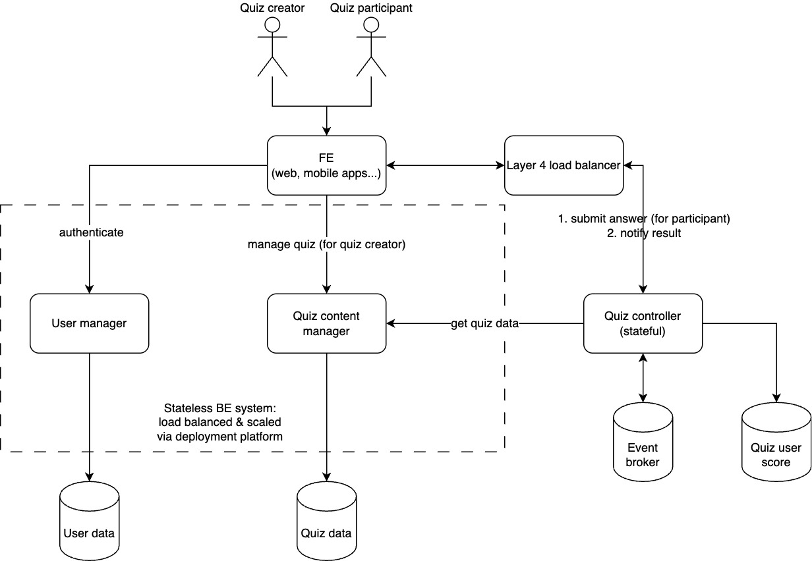
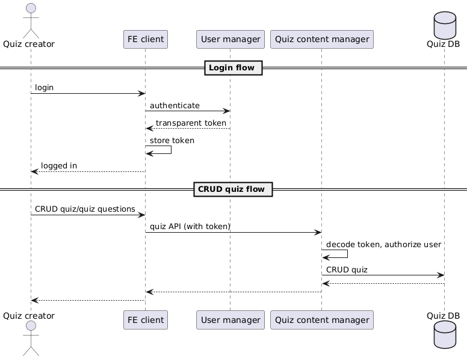
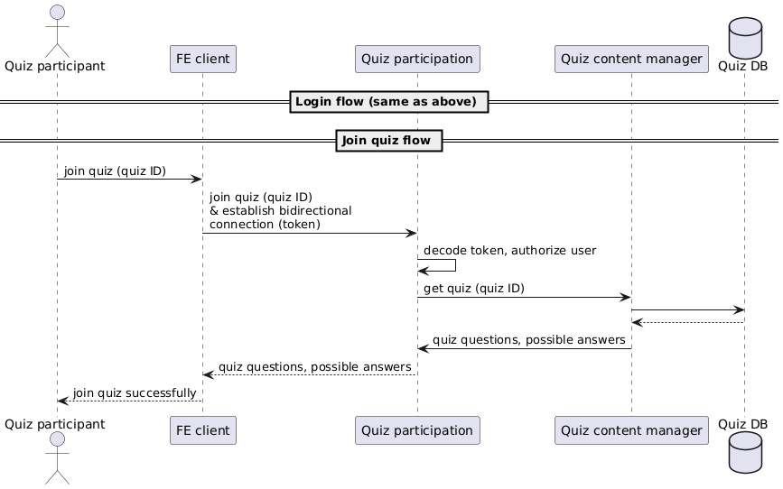
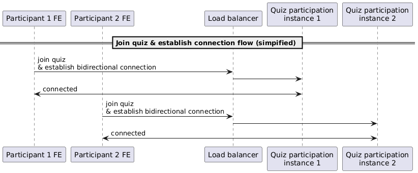
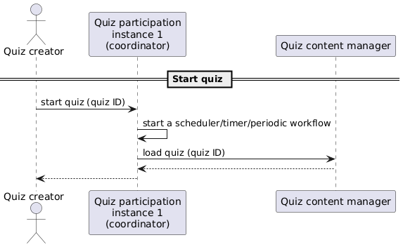
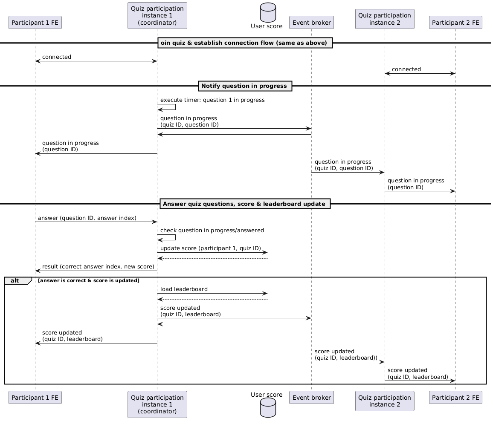
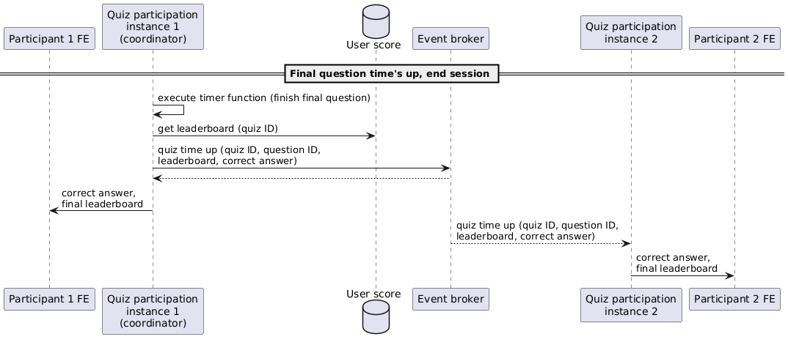

# Real-Time Vocabulary Quiz Design Document

## [Requirements](./requirements.md)

### Functional
- Multiple users can join a quiz & compete with others
- Quizs have leaderboard, with score updated in real time & visible to users in the quiz (see also Assumptions)

### Non-functional
- Scalability
- Performance
- Reliability
- Maintainability
- Observability

## Assumptions
*Since the requirements are simply too vague to design/implement a workable system,
I make the following assumption in order to proceed:*
- Is the quiz questions time-bounded (~Kahoot), or is the time for a single question unlimited,
and the final result calculated at the end of the test (~online test)?
Since we want "real-time" update of the user score for a sense of competition,
I assume we want a system similar to Kahoot, not an online test taker.
**Each question last for a configured duration. The quiz ends when all questions ends.**
- -> How long does the quiz last? = time for 1 question x number of questions
- Do quiz data needs to be persisted for a long time? No
- Can a participating user leave the quiz? No
- -> If yes, is disconnection considered leaving the quiz? No. The user is considered giving no answers to the questions shown after disconnection.
- -> And is reconnection possible? Manually by users by re-entering the quiz ID.
- What question type is supported? Only multiple-choice, single-answer questions.
- See also [Maintainability](#maintainability) for plan to handle a new question type.
- Who starts the quiz? The quiz creator is responsible for starting the quiz.

**Overall, with the above requirements and assumptions, the system will have the functionalities quite similar to Kahoot.**

## Main system components
Here I list out the main **logical** components necessary to implement the feature.
How each component is organized and deployed
(eg as a single repo and deployment unit or as multiple services managed by different teams) are not considered here.
The following decomposition aims at scalability,
both technically in terms of load and organizationally in terms of system complexity and team division.
However, depending on the need of the business, a simple,
monolithic system can be built and scaled to support up to millions of concurrent users.

| **Component**                   | **Description**                                                                                                                               |
|---------------------------------|-----------------------------------------------------------------------------------------------------------------------------------------------|
| FE clients                      | Provide the UI for login, quiz management and quiz participation                                                                              |
| User manager & database         | Manage & authenticate users                                                                                                                   |
| Quiz content manager & database | Manage quiz content, including questions, answers, duration, etc Also provide an API to check whether an answer to a quiz question is correct |
| Quiz controller                 | Provide quiz participation functionality, including answering & viewing score/leaderboard in real time                                        |
| Layer 4 load balancer           | Load balance the connections across the quiz controller instances (see also Scalability)                                                      |
| Event broker                    | Provide communication mechanism between the quiz controller instances (see detailed flow below)                                               |
| Quiz user score database        | Store user scores, supporting sort and ranking                                                                                                |

## Data flow

### Quiz content management

#### Join quiz

### Compete in a real-time quiz

#### Joining quiz & load balancing n user sessions across m instances
*Here I draw the flow for 2 FE session with 2 BE instances.
The connection and load balancing process is the same for n sessions across m instances.*

#### Start quiz
*Here I choose instance 1 as the quiz coordinator. However, it should be noted that,
as the start quiz requests are load balanced across the instances,
each instance should have equal probability of being the coordinator.
Therefore, the load should also be equally distributed across the instances.*

#### Answer quiz questions, update score & leaderboard in real-time
*Due to the limitation of sequence diagrams, the concurrency of the system operations is not shown.
But it should be noted that all operations that involve both quiz 1 & 2 instances are executed concurrently
(for example, receiving event from the broker, sending updates to clients)

Error handling: if a client session tries to submit an answer to timed out questions,
the coordinate will reject the request even if the answer is 

Consistency: when an answer is submitted and the score updated,
the leaderboard is loaded once and passed to all instances and pushed to clients.
Therefore, the info displayed on all clients is consistent.*

#### End quiz

## Technologies & tools
Due to the limited time to complete this coding challenge, I choose the technologies that I’m familiar with,
and can satisfy the accuracy requirements, while having good performance in general.
A detailed analysis of the performance and the highest load that can be handled is out of scope.
Some potential bottlenecks and optimizations are discussed in Scalability.
In general, the following factors should be considered when choosing technologies, with decreasing level of importance:
1. Expertise & commitment of the organization with the technology
2. Whether the technology meets the functional and non-functional requirement
(less important than 1 because potential workaround/optimization can usually be implemented for an inadequate,
unsuitable technology, at the cost of decreased reliability and increased complexity)
3. Stability, popularity, community, professional support

| **Components**                                                            | **Technology**                                                   | **Justification**                                                                                                                                                                                                                                                                                                                                                             |
|---------------------------------------------------------------------------|------------------------------------------------------------------|-------------------------------------------------------------------------------------------------------------------------------------------------------------------------------------------------------------------------------------------------------------------------------------------------------------------------------------------------------------------------------|
| BE-clients real time communication                                        | Websocket Socket.IO                                              | Websocket is used for real-time, bidirectional communication between clients and BE. Socket.IO provides a high level abstraction (events, rooms, etc) which fit this particular use case (events = answer submission & leaderboard update, rooms = quiz sessions).                                                                                                            |
| User & quiz content databases                                             | Any                                                              | Any popular database can be used. Some preferred characteristics: 1. Built-in support for horizontal scaling, 2. Transaction support, 3. Simple, low overhead schema evolution, 4. Built-in support for replication & failover                                                                                                                                                |
| Implementation language for services: Quiz content, Quiz controller, User | Golang                                                           | Good performance Compiled & typed language -> good maintainability Existing Socket.IO implementation                                                                                                                                                                                                                                                                          |
| Event broker                                                              | Kafka                                                            | Standard, scalable, strong community support                                                                                                                                                                                                                                                                                                                                  |
| Deployment platform                                                       | Kubernetes                                                       | Standard, load balancing support, simple resource management                                                                                                                                                                                                                                                                                                                  |
| Layer 4 load balancer                                                     | Any software, special hardware might be required for performance |                                                                                                                                                                                                                                                                                                                                                                               |
| Quiz user score datastore                                                 | Redis                                                            | Redis has built-in operation suitable for leaderboard, with high performance. A cluster can be used to improve reliability. A quiz session is short-lived, which also fit Redis use case. If durability is required (for example to display quiz session results), any persistent database with in-memory layer and sorting/ranking support can be used (eg Mongo, Couchbase) |

## Design considerations

### Scalability
- Large amount of user/quiz content data:
  - Scale the databases (built-in support or manual sharding)
  - Archive old quiz data, inactive users
- The 3 services: horizontal scale by the deployment platform, with appropriate scaling metrics:
  - Resource utilization (CPU, memory, IO etc)
  - Number of concurrent connections (for Quiz controller service)
- Event broker:
  - Add more brokers
  - Use 1 channel (topic)/quiz, created/removed dynamically by the publisher when a quiz is started/ended.
  Publisher/subscriber only subscribes the necessary channel.
- Quiz user score: shard the data by quiz ID
- Layer 4 load balancer: add more load balancer, with a service discovery layer on top
- Scale the organization & manage business complexity:
  - Different services managed by different team
  - Isolate answer-checking & scoring functionality in Quiz content service
  -> avoid duplicating logic in Quiz controller service & make it easy to add more question types & scoring mechanism

### Performance
In general, scaling techniques discussed above should improve performance by reducing load & remove bottlenecks.
Other optimizations:
- User database, quiz database: request pattern is probably read-heavy,
so adding a caching layer on top can improve response time
- Quiz binary data (eg image, sound): CDN
- Network round-trip: deploy to different regions with data replication, routing based on geo-location

### Reliability
- Techniques (a detailed discussion of cost consideration, replication & fail-over algorithm is out of scope):
  - Data replication
  - Load balancing
  - Hot replica (for the stateful Quiz controller service), standby cluster
  - **Quiz session scheduling** is currently handled by a coordinator Quiz session manager instance,
  which is not resilient to failure. To ensure reliable execution and observability, workflow platform can be used (eg Temporal).
- Process: capacity planning, disaster recovery training, and other reliability processes should also be implemented.

### Maintainability
3 levels of document should be maintained:
- High level abstraction of the system, conceptual relationship, design decision & tradeoffs:
via external doc. Doc ownership, periodic review and update should be required.
- API-level: via top-level, interface comments in the code,
with external doc generated automatically via code annotation & tooling
- Implementation details & decision: clear type & function naming, supplemented with implementation comments in the code

Design decision & refactoring consideration should be evaluated continuously after gaining new business insights or after launching & getting load & performance metrics.

### Observability
- Logging, aggregation & searching: service console output -> side car aggregation
-> fulltext search DB (eg Elasticsearch) -> visualization UI (eg Kibana)
- Monitoring dashboard & alerting:
  - Resource utilization: deployment platform metrics -> metrics store (eg Prometheus) -> visualization UI (eg Grafana)
  - Alerting: metrics store -> alert config -> email/chat/call channel
  - Service-specific metrics: concurrent connections, response time, error rate, dependency services latency/error rate
  - Middleware metrics: eg DB read/write/disk access/query duration, load balancer concurrent connection, response time
- User behavior: user analytic metrics, analytic database & queries

## Implementation

### Components
- Real components:
  - The Quiz controller service (Golang), which implements the required real-time functionalities
  - A Kafka broker, which facilitates the communication between the Quiz controller instances
  - A Redis cache, which stores user score & leaderboard data
- Mock/fake modules:
  - Frontend: a command-line client (JS) representing the frontend module
  - Quiz content manager: Quiz content data is hardcoded directly in Quiz controller service
  - User manager: a user is uniquely identified by the Quiz controller service by user ID (entered by user)
  - The load balancer: clients specify the port of the instance directly to simulate load-balanced connections

### Architecture

### Code organization
To improve maintainability, I organize the BE code following the hexagonal architecture. There are 3 main layers:
- Inbound: entry points to the system: encapsulate the underlying technologies & call the core operations:
  - Websocket: trigger join quiz, answer question
  - HTTP handlers: trigger start quiz
  - (Kafka) consumers: handle quiz progress event
- Core (business logic): contains main business logic and data models.
The main operations specified in the design are implemented here and are part of the public interface, including:
  - Start quiz
  - Join quiz
  - Answer question
  - Handle quiz progressed event sent by the coordinator
  - Handle score updated event sent by the instance which updates the score
  - The coordinator loop, which has 2 main operations:
    - Start a new question
    - End quiz session
- Outbound: external systems that the system requests/notifies:
  - Event publisher: encapsulate event encoding & producing logic
  - Data store: encapsulate Redis APIs into standard leaderboard operations
  - HTTP handlers
  - Websocket: encapsulate socket.io logic into standard sending/broadcasting operations

Due to the limited time to complete this challenge, I make no attempt to write the interfaces and unit tests.
However, due to the modularity of the code, refactoring to facilitate mocks, fakes & unit testing is simple to do.
The inbound and outbound operations are also standardized and mostly independent of the underlying technologies,
which eases the transition between similar technologies.

### How to run
1. Start kafka broker (port 9092)
2. Start redis (port 6379)
3. Start temporal (port 7233)
4. Build server binary `cd quiz-server && go build -o ../ . && cd ..`
5. Build temporal worker `cd quiz-server/workflow/worker && go build -o ../../../ . && cd ../../../`
6. Start server binary `PORT=8081 ./quiz`
7. Start temporal worker binary `./worker`
8. Start the quiz client `cd quiz-client && npm i && npm start`
9. Start the quiz `curl localhost:8081/start/[quiz ID]`
10. Enter username and quiz ID in the client to join the quiz